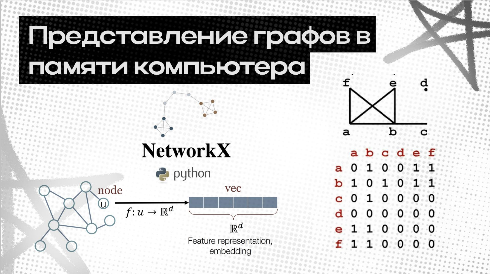
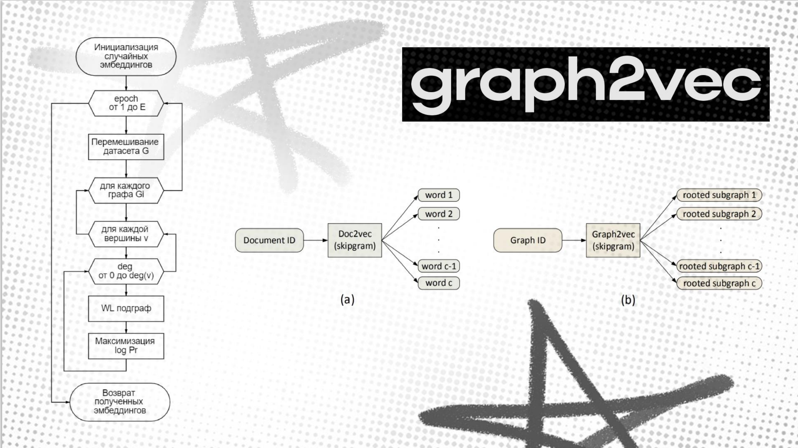
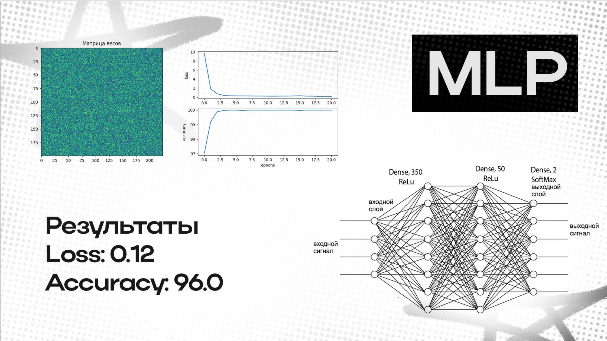

# 📊 Classification of Graphs Using Neural Networks

Проект по классификации графов (сетей) с помощью графовых нейронных сетей (GNN).

  
  
  

---

## 📌 Описание проекта

В этом проекте мы:

1. Подготавливаем и загружаем наборы графов (например, MUTAG, PROTEINS).  
2. Реализуем модель графовой нейронной сети (GCN / GAT) на PyTorch Geometric.  
3. Обучаем модель и отслеживаем метрики (accuracy, loss).  
4. Оцениваем качество на тестовом наборе и строим матрицу ошибок.  
5. Сравниваем разные архитектуры и гиперпараметры.

---

## 🛠️ Технологии

- Python 3.8+  
- PyTorch & PyTorch Geometric  
- scikit-learn (метрики, визуализация)  
- matplotlib / seaborn  
- Jupyter Notebooks для EDA и визуализаций  

---

## 📂 Структура проекта

